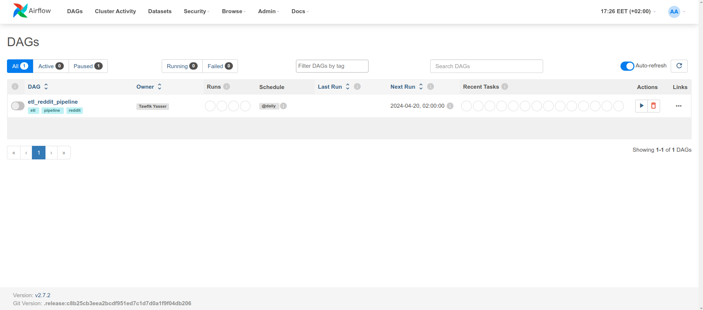
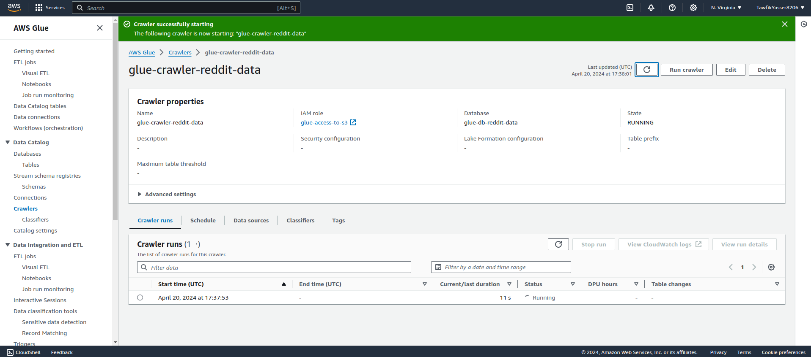
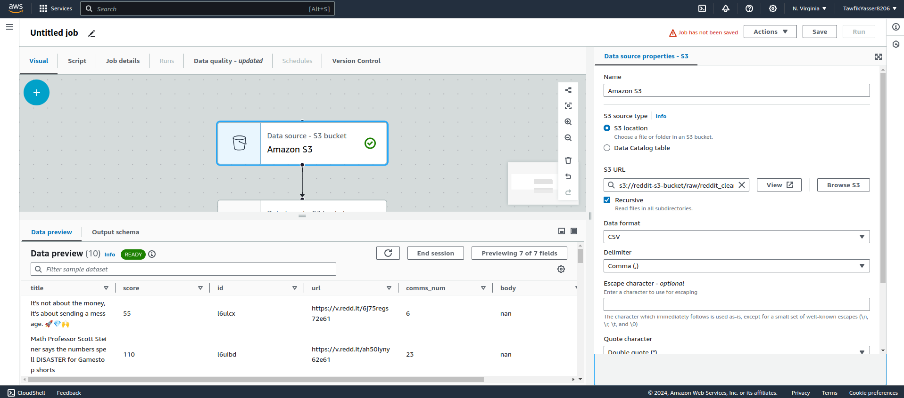
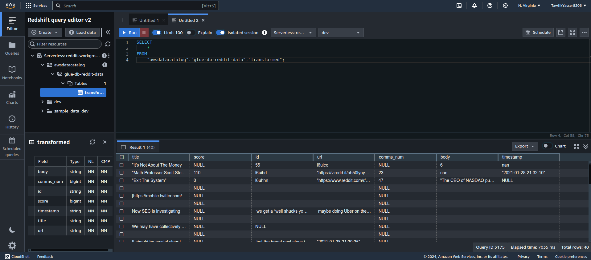
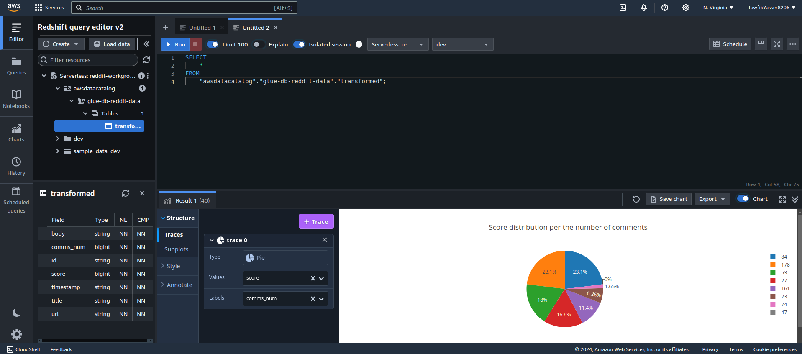

# reddit-acps3gar

A robust data engineering pipeline that extracts data from Reddit, processes it using Apache Airflow and Celery, stores it in PostgreSQL, and further integrates with AWS services like S3, Glue, Athena, and Redshift for advanced analytics and querying.


---

## 📖 Table of Contents

- [About](#about)
- [Architecture](#architecture)
- [Features](#features)
- [Prerequisites](#prerequisites)
- [Installation](#installation)
- [Usage](#usage)
- [Project Structure](#project-structure)
- [Technologies Used](#technologies-used)
- [Screenshots](#screenshots)
- [Contributing](#contributing)
- [License](#license)
- [Contact](#contact)

---

## 📌 About

This project demonstrates a complete data pipeline that:

1. **Extracts** data from Reddit using the PRAW (Python Reddit API Wrapper) library.
2. **Processes** the data using Apache Airflow for orchestration and Celery for asynchronous task management.
3. **Stores** the processed data in a PostgreSQL database.
4. **Transfers** data to AWS S3 for storage.
5. **Utilizes** AWS Glue to catalog and transform the data.
6. **Queries** the data using AWS Athena.
7. **Loads** the data into AWS Redshift for advanced analytics.

---

## 🏗️ Architecture

The pipeline follows the Extract → Transform → Load (ETL) paradigm:

1. **Extraction**:
   - Utilizes PRAW to fetch data from specified subreddits.

2. **Transformation**:
   - Processes and cleans the data using Pandas and NumPy.
   - Orchestrated using Apache Airflow DAGs.
   - Asynchronous tasks managed by Celery.

3. **Loading**:
   - Stores the cleaned data into PostgreSQL.
   - Uploads data to AWS S3.
   - AWS Glue catalogs the data and performs ETL operations.
   - AWS Athena is used for querying the data.
   - Final data is loaded into AWS Redshift for analytics.

---

## ✨ Features

- Automated data extraction from Reddit.
- Data processing and cleaning using Pandas and NumPy.
- Task orchestration with Apache Airflow.
- Asynchronous task management with Celery.
- Data storage in PostgreSQL.
- Integration with AWS services: S3, Glue, Athena, and Redshift.
- Dockerized setup for easy deployment.

---

## ✅ Prerequisites

Before you begin, ensure you have met the following requirements:

- Docker and Docker Compose installed on your machine.
- AWS account with access to S3, Glue, Athena, and Redshift.
- Reddit API credentials (client ID and secret).
- Python 3.7 or higher installed.

---

## 🚀 Installation

1. **Clone the repository**:

   ```bash
   git clone https://github.com/TawfikYasser/reddit-acps3gar.git
   cd reddit-acps3gar
   ```

2. **Set up environment variables**:

   - Create a `.env` file in the root directory and add your Reddit and AWS credentials.
   - Refer to the `.env.example` file for the required variables.

3. **Build and start the Docker containers**:

   ```bash
   docker-compose up --build
   ```

4. **Initialize the Airflow database**:

   ```bash
   docker-compose exec airflow-webserver airflow db init
   ```

5. **Create an Airflow user**:

   ```bash
   docker-compose exec airflow-webserver airflow users create \
       --username admin \
       --firstname Firstname \
       --lastname Lastname \
       --role Admin \
       --email admin@example.com
   ```

6. **Access the Airflow web interface**:

   - Navigate to `http://localhost:8080` in your browser.
   - Log in with the credentials you just created.

---

## 🛠️ Usage

1. **Trigger the Airflow DAG**:

   - In the Airflow web interface, locate the DAG named `reddit_pipeline`.
   - Turn it on and trigger it manually or set a schedule.

2. **Monitor the pipeline**:

   - Use the Airflow interface to monitor task execution.
   - Check logs for any errors or issues.

3. **Access the data**:

   - Processed data will be available in PostgreSQL.
   - Data uploaded to AWS S3 can be queried using Athena.
   - Final datasets are stored in AWS Redshift for analytics.

---

## 📁 Project Structure

```bash
reddit-acps3gar/
├── config/                 # Configuration files
├── dags/                   # Airflow DAGs
├── data/                   # Raw and processed data
├── etls/                   # ETL scripts
├── logs/                   # Log files
├── pipelines/              # Pipeline scripts
├── test/                   # Test cases
├── utils/                  # Utility functions
├── .env                    # Environment variables
├── .gitignore              # Git ignore file
├── Dockerfile              # Dockerfile for building the image
├── README.md               # Project documentation
├── airflow.env             # Airflow environment variables
├── docker-compose.yml      # Docker Compose configuration
├── requirements.txt        # Python dependencies
└── *.png                   # Images and diagrams
```

---

## 🧰 Technologies Used

- **Programming Languages**: Python
- **Data Extraction**: PRAW (Python Reddit API Wrapper)
- **Data Processing**: Pandas, NumPy
- **Workflow Orchestration**: Apache Airflow
- **Asynchronous Task Management**: Celery
- **Database**: PostgreSQL
- **Cloud Services**:
  - AWS S3
  - AWS Glue
  - AWS Athena
  - AWS Redshift
- **Containerization**: Docker, Docker Compose

---

## 📸 Screenshots

**Airflow DAGs**:



**AWS Glue Crawler**:



**AWS Glue ETL Job**:



**Redshift Query Editor**:



**Redshift Dashboard**:



---

## 🤝 Contributing

Contributions are welcome! To contribute:

1. **Fork** the repository.
2. **Create** a new branch: `git checkout -b feature/your-feature-name`.
3. **Commit** your changes: `git commit -m 'Add some feature'`.
4. **Push** to the branch: `git push origin feature/your-feature-name`.
5. **Submit** a pull request.

Please ensure your code adheres to the project's coding standards and includes relevant tests.

---

## 📄 License

This project is licensed under the [MIT License](LICENSE).

---

## 📬 Contact

**Tawfik Yasser**  
GitHub: [@TawfikYasser](https://github.com/TawfikYasser)

---
